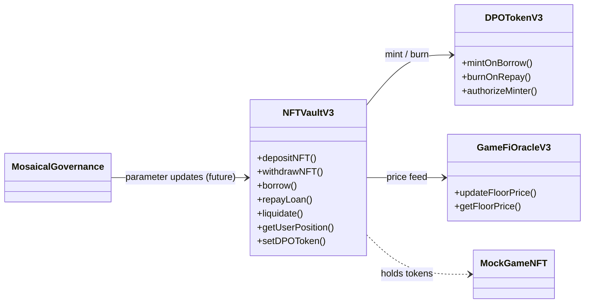
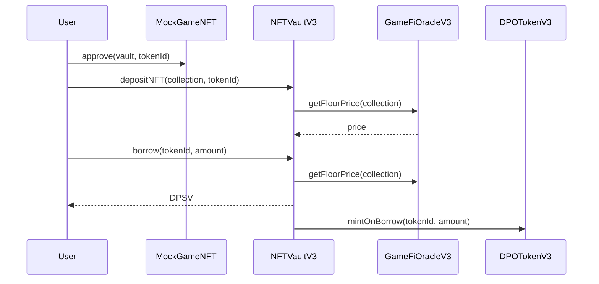

# Mosaical DeFi – Smart-Contracts (`src/`)

Mosaical unlocks liquidity from **GameFi NFTs** by allowing players to borrow the native chain currency (DPSV) against in-game assets. When a loan is opened the vault mints **DPO (Debt Position Ownership) ERC-20** tokens that fractionalise the debt and can be freely traded.

---
## 1  Package scope
This document covers only the Solidity code and Hardhat workflow contained in `src/`.  For a system-level overview and business rationale see the root-level `README.md`.

---
## 2  Core contracts
| Contract | Responsibility |
|----------|---------------|
| **NFTVaultV3** | Deposit/withdraw NFTs, borrow & repay, account-health tracking, liquidation |
| **DPOTokenV3** | ERC-20 representing the debt of a single NFT; minted on borrow, burned on repay |
| **GameFiOracleV3** | Holds floor prices for supported collections (set by admin) |
| **GovernanceToken** | ERC-20 voting token for future on-chain governance |
| **MosaicalGovernance** | Governor + timelock (to be enabled in v4) |
| **MockGameNFT** | Simple ERC-721 used in tests & demos |

> A standalone `LoanManager` was removed in **v3** – all accounting now lives inside `NFTVaultV3`.

---
## 3  Contract relationships


---
## 4  Borrow flow (sequence)


---
## 5  Development workflow
```bash
# install deps once
cd src
npm install

# run unit tests
npx hardhat test

# local node + scripted deployment
npx hardhat node &
npx hardhat run scripts/full_setup.js --network localhost
```

### Useful scripts
| Script | Purpose |
|--------|---------|
| `scripts/full_setup.js` | Deploy contracts, seed oracle, mint test NFTs, open example loans |
| `scripts/direct_full_setup.js` | Same but via ethers.js for prod networks |
| `scripts/flatten.js` | Write flattened sources into `flattened/` for verification |
| `scripts/verify*.js` | One-shot explorer verification helpers |

---
## 6  Testing
```bash
npx hardhat test          # mocha/chai unit tests
npx hardhat coverage      # solidity-coverage
```
Focus areas in the suite:
* deposit ➜ borrow ➜ repay
* interest accrual per-block
* liquidation when LTV ≥ threshold

---
## 7  Checklist
- [x] Deposit / Withdraw NFT
- [x] Borrow & Repay with interest accrual
- [x] DPO token minted & transferable
- [x] Admin can add collection & update floor price
- [ ] Governance proposals _(pending)_
- [ ] Cross-chain bridge _(future)_

---
## 8  Known limitations
* Oracle prices are set manually by an admin.
* Interest is linear (simple) not compound.
* No upgradeability proxies yet (upgrade will be via timelocked redeploy).

---
## 9  Roadmap
1. Integrate Chainlink floor-price feeds.
2. Migrate DPO token to ERC-3525 or ERC-1155 for gas optimisation.
3. Enable on-chain governance (`MosaicalGovernance`).
4. Add flash-liquidation auction module.